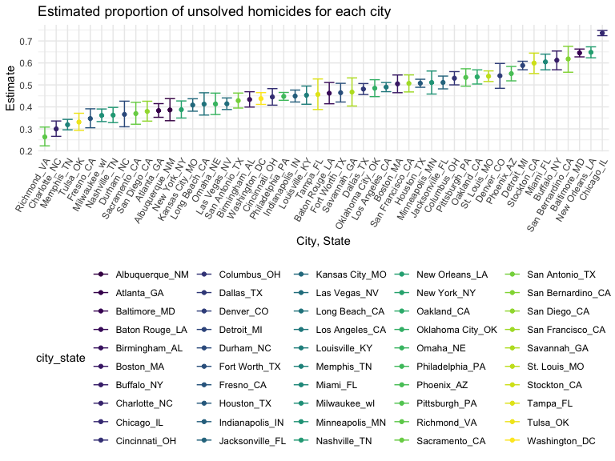
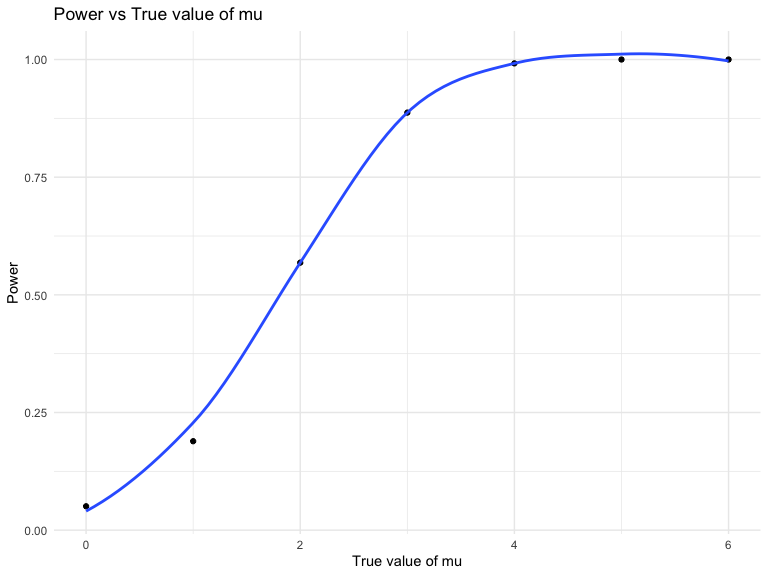
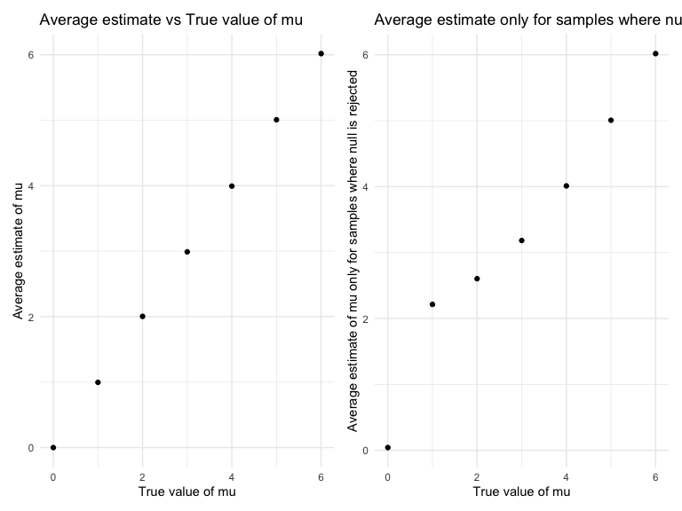

p8105_hw5_gw2442
================
2022-11-10

``` r
library(tidyverse)
```

    ## ── Attaching packages ─────────────────────────────────────── tidyverse 1.3.2 ──
    ## ✔ ggplot2 3.3.6      ✔ purrr   0.3.4 
    ## ✔ tibble  3.1.8      ✔ dplyr   1.0.10
    ## ✔ tidyr   1.2.0      ✔ stringr 1.4.1 
    ## ✔ readr   2.1.2      ✔ forcats 0.5.2 
    ## ── Conflicts ────────────────────────────────────────── tidyverse_conflicts() ──
    ## ✖ dplyr::filter() masks stats::filter()
    ## ✖ dplyr::lag()    masks stats::lag()

``` r
library(rvest)
```

    ## 
    ## Attaching package: 'rvest'
    ## 
    ## The following object is masked from 'package:readr':
    ## 
    ##     guess_encoding

``` r
library(broom)
library(patchwork)
library(dplyr)
set.seed(1)

knitr::opts_chunk$set(
    echo = TRUE,
    warning = FALSE,
    fig.width = 8, 
  fig.height = 6,
  out.width = "90%"
)

options(
  ggplot2.continuous.colour = "viridis",
  ggplot2.continuous.fill = "viridis"
)

scale_colour_discrete = scale_colour_viridis_d
scale_fill_discrete = scale_fill_viridis_d

theme_set(theme_minimal() + theme(legend.position = "bottom"))
```

## Problem 1

The code chunk below imports the data in individual spreadsheets
contained in `./data/zip_data/`. To do this, I create a dataframe that
includes the list of all files in that directory and the complete path
to each file. As a next step, I `map` over paths and import data using
the `read_csv` function. Finally, I `unnest` the result of `map`.

``` r
full_df = 
  tibble(
    files = list.files("data/zip_data/"),
    path = str_c("data/zip_data/", files)
  ) %>% 
  mutate(data = map(path, read_csv)) %>% 
  unnest()
```

    ## Rows: 1 Columns: 8
    ## ── Column specification ────────────────────────────────────────────────────────
    ## Delimiter: ","
    ## dbl (8): week_1, week_2, week_3, week_4, week_5, week_6, week_7, week_8
    ## 
    ## ℹ Use `spec()` to retrieve the full column specification for this data.
    ## ℹ Specify the column types or set `show_col_types = FALSE` to quiet this message.
    ## Rows: 1 Columns: 8
    ## ── Column specification ────────────────────────────────────────────────────────
    ## Delimiter: ","
    ## dbl (8): week_1, week_2, week_3, week_4, week_5, week_6, week_7, week_8
    ## 
    ## ℹ Use `spec()` to retrieve the full column specification for this data.
    ## ℹ Specify the column types or set `show_col_types = FALSE` to quiet this message.
    ## Rows: 1 Columns: 8
    ## ── Column specification ────────────────────────────────────────────────────────
    ## Delimiter: ","
    ## dbl (8): week_1, week_2, week_3, week_4, week_5, week_6, week_7, week_8
    ## 
    ## ℹ Use `spec()` to retrieve the full column specification for this data.
    ## ℹ Specify the column types or set `show_col_types = FALSE` to quiet this message.
    ## Rows: 1 Columns: 8
    ## ── Column specification ────────────────────────────────────────────────────────
    ## Delimiter: ","
    ## dbl (8): week_1, week_2, week_3, week_4, week_5, week_6, week_7, week_8
    ## 
    ## ℹ Use `spec()` to retrieve the full column specification for this data.
    ## ℹ Specify the column types or set `show_col_types = FALSE` to quiet this message.
    ## Rows: 1 Columns: 8
    ## ── Column specification ────────────────────────────────────────────────────────
    ## Delimiter: ","
    ## dbl (8): week_1, week_2, week_3, week_4, week_5, week_6, week_7, week_8
    ## 
    ## ℹ Use `spec()` to retrieve the full column specification for this data.
    ## ℹ Specify the column types or set `show_col_types = FALSE` to quiet this message.
    ## Rows: 1 Columns: 8
    ## ── Column specification ────────────────────────────────────────────────────────
    ## Delimiter: ","
    ## dbl (8): week_1, week_2, week_3, week_4, week_5, week_6, week_7, week_8
    ## 
    ## ℹ Use `spec()` to retrieve the full column specification for this data.
    ## ℹ Specify the column types or set `show_col_types = FALSE` to quiet this message.
    ## Rows: 1 Columns: 8
    ## ── Column specification ────────────────────────────────────────────────────────
    ## Delimiter: ","
    ## dbl (8): week_1, week_2, week_3, week_4, week_5, week_6, week_7, week_8
    ## 
    ## ℹ Use `spec()` to retrieve the full column specification for this data.
    ## ℹ Specify the column types or set `show_col_types = FALSE` to quiet this message.
    ## Rows: 1 Columns: 8
    ## ── Column specification ────────────────────────────────────────────────────────
    ## Delimiter: ","
    ## dbl (8): week_1, week_2, week_3, week_4, week_5, week_6, week_7, week_8
    ## 
    ## ℹ Use `spec()` to retrieve the full column specification for this data.
    ## ℹ Specify the column types or set `show_col_types = FALSE` to quiet this message.
    ## Rows: 1 Columns: 8
    ## ── Column specification ────────────────────────────────────────────────────────
    ## Delimiter: ","
    ## dbl (8): week_1, week_2, week_3, week_4, week_5, week_6, week_7, week_8
    ## 
    ## ℹ Use `spec()` to retrieve the full column specification for this data.
    ## ℹ Specify the column types or set `show_col_types = FALSE` to quiet this message.
    ## Rows: 1 Columns: 8
    ## ── Column specification ────────────────────────────────────────────────────────
    ## Delimiter: ","
    ## dbl (8): week_1, week_2, week_3, week_4, week_5, week_6, week_7, week_8
    ## 
    ## ℹ Use `spec()` to retrieve the full column specification for this data.
    ## ℹ Specify the column types or set `show_col_types = FALSE` to quiet this message.
    ## Rows: 1 Columns: 8
    ## ── Column specification ────────────────────────────────────────────────────────
    ## Delimiter: ","
    ## dbl (8): week_1, week_2, week_3, week_4, week_5, week_6, week_7, week_8
    ## 
    ## ℹ Use `spec()` to retrieve the full column specification for this data.
    ## ℹ Specify the column types or set `show_col_types = FALSE` to quiet this message.
    ## Rows: 1 Columns: 8
    ## ── Column specification ────────────────────────────────────────────────────────
    ## Delimiter: ","
    ## dbl (8): week_1, week_2, week_3, week_4, week_5, week_6, week_7, week_8
    ## 
    ## ℹ Use `spec()` to retrieve the full column specification for this data.
    ## ℹ Specify the column types or set `show_col_types = FALSE` to quiet this message.
    ## Rows: 1 Columns: 8
    ## ── Column specification ────────────────────────────────────────────────────────
    ## Delimiter: ","
    ## dbl (8): week_1, week_2, week_3, week_4, week_5, week_6, week_7, week_8
    ## 
    ## ℹ Use `spec()` to retrieve the full column specification for this data.
    ## ℹ Specify the column types or set `show_col_types = FALSE` to quiet this message.
    ## Rows: 1 Columns: 8
    ## ── Column specification ────────────────────────────────────────────────────────
    ## Delimiter: ","
    ## dbl (8): week_1, week_2, week_3, week_4, week_5, week_6, week_7, week_8
    ## 
    ## ℹ Use `spec()` to retrieve the full column specification for this data.
    ## ℹ Specify the column types or set `show_col_types = FALSE` to quiet this message.
    ## Rows: 1 Columns: 8
    ## ── Column specification ────────────────────────────────────────────────────────
    ## Delimiter: ","
    ## dbl (8): week_1, week_2, week_3, week_4, week_5, week_6, week_7, week_8
    ## 
    ## ℹ Use `spec()` to retrieve the full column specification for this data.
    ## ℹ Specify the column types or set `show_col_types = FALSE` to quiet this message.
    ## Rows: 1 Columns: 8
    ## ── Column specification ────────────────────────────────────────────────────────
    ## Delimiter: ","
    ## dbl (8): week_1, week_2, week_3, week_4, week_5, week_6, week_7, week_8
    ## 
    ## ℹ Use `spec()` to retrieve the full column specification for this data.
    ## ℹ Specify the column types or set `show_col_types = FALSE` to quiet this message.
    ## Rows: 1 Columns: 8
    ## ── Column specification ────────────────────────────────────────────────────────
    ## Delimiter: ","
    ## dbl (8): week_1, week_2, week_3, week_4, week_5, week_6, week_7, week_8
    ## 
    ## ℹ Use `spec()` to retrieve the full column specification for this data.
    ## ℹ Specify the column types or set `show_col_types = FALSE` to quiet this message.
    ## Rows: 1 Columns: 8
    ## ── Column specification ────────────────────────────────────────────────────────
    ## Delimiter: ","
    ## dbl (8): week_1, week_2, week_3, week_4, week_5, week_6, week_7, week_8
    ## 
    ## ℹ Use `spec()` to retrieve the full column specification for this data.
    ## ℹ Specify the column types or set `show_col_types = FALSE` to quiet this message.
    ## Rows: 1 Columns: 8
    ## ── Column specification ────────────────────────────────────────────────────────
    ## Delimiter: ","
    ## dbl (8): week_1, week_2, week_3, week_4, week_5, week_6, week_7, week_8
    ## 
    ## ℹ Use `spec()` to retrieve the full column specification for this data.
    ## ℹ Specify the column types or set `show_col_types = FALSE` to quiet this message.
    ## Rows: 1 Columns: 8
    ## ── Column specification ────────────────────────────────────────────────────────
    ## Delimiter: ","
    ## dbl (8): week_1, week_2, week_3, week_4, week_5, week_6, week_7, week_8
    ## 
    ## ℹ Use `spec()` to retrieve the full column specification for this data.
    ## ℹ Specify the column types or set `show_col_types = FALSE` to quiet this message.

The result of the previous code chunk isn’t tidy – data are wide rather
than long, and some important variables are included as parts of others.
The code chunk below tides the data using string manipulations on the
file, converting from wide to long, and selecting relevant variables.

``` r
tidy_df = 
  full_df %>% 
  mutate(
    files = str_replace(files, ".csv", ""),
    group = str_sub(files, 1, 3)) %>% 
  pivot_longer(
    week_1:week_8,
    names_to = "week",
    values_to = "outcome",
    names_prefix = "week_") %>% 
  mutate(week = as.numeric(week)) %>% 
  select(group, subj = files, week, outcome)
```

Finally, the code chunk below creates a plot showing individual data,
faceted by group.

``` r
tidy_df %>% 
  ggplot(aes(x = week, y = outcome, group = subj, color = group)) + 
  geom_point() + 
  geom_path() + 
  facet_grid(~group)
```


This plot suggests high within-subject correlation – subjects who start
above average end up above average, and those that start below average
end up below average. Subjects in the control group generally don’t
change over time, but those in the experiment group increase their
outcome in a roughly linear way.

## Problem 2

#### Importing and describing raw data:

``` r
homicide_data = read_csv(file = "./data/homicide-data.csv") %>%
  janitor::clean_names()
```

    ## Rows: 52179 Columns: 12
    ## ── Column specification ────────────────────────────────────────────────────────
    ## Delimiter: ","
    ## chr (9): uid, victim_last, victim_first, victim_race, victim_age, victim_sex...
    ## dbl (3): reported_date, lat, lon
    ## 
    ## ℹ Use `spec()` to retrieve the full column specification for this data.
    ## ℹ Specify the column types or set `show_col_types = FALSE` to quiet this message.

``` r
skimr::skim(homicide_data)
```

|                                                  |               |
|:-------------------------------------------------|:--------------|
| Name                                             | homicide_data |
| Number of rows                                   | 52179         |
| Number of columns                                | 12            |
| \_\_\_\_\_\_\_\_\_\_\_\_\_\_\_\_\_\_\_\_\_\_\_   |               |
| Column type frequency:                           |               |
| character                                        | 9             |
| numeric                                          | 3             |
| \_\_\_\_\_\_\_\_\_\_\_\_\_\_\_\_\_\_\_\_\_\_\_\_ |               |
| Group variables                                  | None          |

Data summary

**Variable type: character**

| skim_variable | n_missing | complete_rate | min | max | empty | n_unique | whitespace |
|:--------------|----------:|--------------:|----:|----:|------:|---------:|-----------:|
| uid           |         0 |             1 |   9 |  10 |     0 |    52179 |          0 |
| victim_last   |         0 |             1 |   1 |  20 |     0 |    12687 |          0 |
| victim_first  |         0 |             1 |   1 |  28 |     0 |    16640 |          0 |
| victim_race   |         0 |             1 |   5 |   8 |     0 |        6 |          0 |
| victim_age    |         0 |             1 |   1 |   7 |     0 |      102 |          0 |
| victim_sex    |         0 |             1 |   4 |   7 |     0 |        3 |          0 |
| city          |         0 |             1 |   5 |  14 |     0 |       50 |          0 |
| state         |         0 |             1 |   2 |   2 |     0 |       28 |          0 |
| disposition   |         0 |             1 |  14 |  21 |     0 |        3 |          0 |

**Variable type: numeric**

| skim_variable | n_missing | complete_rate |        mean |         sd |          p0 |         p25 |         p50 |         p75 |          p100 | hist  |
|:--------------|----------:|--------------:|------------:|-----------:|------------:|------------:|------------:|------------:|--------------:|:------|
| reported_date |         0 |             1 | 20130899.16 | 1123419.63 | 20070101.00 | 20100318.00 | 20121216.00 | 20150911.00 | 201511105\.00 | ▇▁▁▁▁ |
| lat           |        60 |             1 |       37.03 |       4.35 |       25.73 |       33.77 |       38.52 |       40.03 |         45.05 | ▁▅▅▇▅ |
| lon           |        60 |             1 |      -91.47 |      13.75 |     -122.51 |      -96.00 |      -87.71 |      -81.76 |        -71.01 | ▃▁▃▇▅ |

The CSV file was downloaded from the GitHub repository, imported, and
cleaned. The dataset `homicide_data` has 52,179 rows and 12 columns. The
dataset contains information on the homicide ID number, reported date,
the victim’s first and last name, race, age, sex, location of homicide
(including city, state, longtidue, and latitude), and disposition of the
case. While there are 0 missing variables for variables `uid`,
`victim_last`, `victim_first`, `victim_race`, `victim_age`,
`victim_sex`, `city`, `state`, `disposition`, and `reported date`, there
are 60 missing variables for `lat` and `lon`.

#### Creating variable `city_state`:

``` r
homicide_data =
  homicide_data %>%
  mutate(
    city_state = as.character(paste(city, state, sep = "_")))
```

#### Creating variable `unsolved_homicide`:

The variable `unsolved_homicide` was created. Those with the disposition
“Closed without arrest” or “Open/No arrest” were categorised as an
unsolved homicide and were therefore given a value of 1 in the variable
`unsolved_homicide`. Those with the disposition “Closed by arrest” were
categorised as a solved homicide and were therefore given a value of 0
in the variable `unsolved_homicide`.

``` r
homicide_data = 
  homicide_data %>%
  mutate(unsolved_homicide = ifelse(disposition == "Closed by arrest", 0, 1)) 

homicide_summary_data = 
  homicide_data %>%
  group_by(city_state, unsolved_homicide) %>%
  summarise(n_obs = n())%>%
  spread(key = unsolved_homicide, value = n_obs) %>%
  select(city_state, solved = `0`, unsolved = `1`) %>%
  drop_na()
```

    ## `summarise()` has grouped output by 'city_state'. You can override using the
    ## `.groups` argument.

``` r
homicide_summary_data$sum <- homicide_summary_data$solved + homicide_summary_data$unsolved 

homicide_summary_data %>%
  arrange(desc(sum)) %>%
  knitr::kable()
```

| city_state        | solved | unsolved |  sum |
|:------------------|-------:|---------:|-----:|
| Chicago_IL        |   1462 |     4073 | 5535 |
| Philadelphia_PA   |   1677 |     1360 | 3037 |
| Houston_TX        |   1449 |     1493 | 2942 |
| Baltimore_MD      |   1002 |     1825 | 2827 |
| Detroit_MI        |   1037 |     1482 | 2519 |
| Los Angeles_CA    |   1151 |     1106 | 2257 |
| St. Louis_MO      |    772 |      905 | 1677 |
| Dallas_TX         |    813 |      754 | 1567 |
| Memphis_TN        |   1031 |      483 | 1514 |
| New Orleans_LA    |    504 |      930 | 1434 |
| Las Vegas_NV      |    809 |      572 | 1381 |
| Washington_DC     |    756 |      589 | 1345 |
| Indianapolis_IN   |    728 |      594 | 1322 |
| Kansas City_MO    |    704 |      486 | 1190 |
| Jacksonville_FL   |    571 |      597 | 1168 |
| Milwaukee_wI      |    712 |      403 | 1115 |
| Columbus_OH       |    509 |      575 | 1084 |
| Atlanta_GA        |    600 |      373 |  973 |
| Oakland_CA        |    439 |      508 |  947 |
| Phoenix_AZ        |    410 |      504 |  914 |
| San Antonio_TX    |    476 |      357 |  833 |
| Birmingham_AL     |    453 |      347 |  800 |
| Nashville_TN      |    489 |      278 |  767 |
| Miami_FL          |    294 |      450 |  744 |
| Cincinnati_OH     |    385 |      309 |  694 |
| Charlotte_NC      |    481 |      206 |  687 |
| Oklahoma City_OK  |    346 |      326 |  672 |
| San Francisco_CA  |    327 |      336 |  663 |
| Pittsburgh_PA     |    294 |      337 |  631 |
| New York_NY       |    384 |      243 |  627 |
| Boston_MA         |    304 |      310 |  614 |
| Tulsa_OK          |    390 |      193 |  583 |
| Louisville_KY     |    315 |      261 |  576 |
| Fort Worth_TX     |    294 |      255 |  549 |
| Buffalo_NY        |    202 |      319 |  521 |
| Fresno_CA         |    318 |      169 |  487 |
| San Diego_CA      |    286 |      175 |  461 |
| Stockton_CA       |    178 |      266 |  444 |
| Richmond_VA       |    316 |      113 |  429 |
| Baton Rouge_LA    |    228 |      196 |  424 |
| Omaha_NE          |    240 |      169 |  409 |
| Albuquerque_NM    |    232 |      146 |  378 |
| Long Beach_CA     |    222 |      156 |  378 |
| Sacramento_CA     |    237 |      139 |  376 |
| Minneapolis_MN    |    179 |      187 |  366 |
| Denver_CO         |    143 |      169 |  312 |
| Durham_NC         |    175 |      101 |  276 |
| San Bernardino_CA |    105 |      170 |  275 |
| Savannah_GA       |    131 |      115 |  246 |
| Tampa_FL          |    113 |       95 |  208 |

The city with the most homicides was Chicago, IL with 5,535 homicides -
1,462 of which were solved and 4,073 were unsolved. Philadelpha, PA is
the city with the second most homicides (3,307), followed by Houston, TX
(2,842)

#### `prop.test` for Baltimore

The function `prop.test` is run for the city of Baltimore to determine
the estimate proportion of homicides that are unsovled and its
confidence intervals:

``` r
baltimore_test = 
  homicide_summary_data %>%
  filter(city_state == "Baltimore_MD") 

baltimore_output = 
  prop.test(baltimore_test %>% pull(unsolved), baltimore_test %>% pull(sum), conf.level = 0.95) %>%
  broom::tidy() %>%
  select(estimate, conf.low, conf.high)

baltimore_output %>%
  knitr::kable()
```

|  estimate |  conf.low | conf.high |
|----------:|----------:|----------:|
| 0.6455607 | 0.6275625 | 0.6631599 |

#### `prop.test` for each of the cities

The function `prop.test`is run for each of the cities in the dataset
`homicide_summary_dataset`:

``` r
b = map2(homicide_summary_data$unsolved, homicide_summary_data$sum, ~prop.test(x = .x, n = .y, conf.level = 0.95))
c = map(.x = b, ~broom::tidy(.x))
d = map(.x = c, ~select(.x, estimate, conf.low, conf.high)) %>%
  tibble() %>%
  unnest()

homicide_summary_analysis =
  cbind(homicide_summary_data, d) %>%
  select(city_state, estimate, conf.low, conf.high) %>%
  arrange(desc(estimate)) 
```

The subsequent tidied dataset `homicide_summary_analysis` demonstrates
the estimated proportion of unsolved murders, and lower and upper limit
of the 95% confidence interval for each city. It is arranged in
descending order. This dataset was obtained first using map2 to map the
function `prop.test` onto each city. Map was then used to tidy the
`prop.test` output, and was used once again to select specifically for
the variables `estimate`, `conf.low`, and `conf.high`.

#### Creating a plot that shows the estimates and confidence intervals for each city:

``` r
homicide_summary_analysis %>%
  ggplot(aes(x = reorder(city_state, estimate), y = estimate, colour = city_state)) +
  geom_errorbar(aes(ymin = conf.low, ymax = conf.high)) +
  geom_point() +
  labs(title = "Estimated proportion of unsolved homicides for each city",
       x = "City, State",
       y = "Estimate") +
       theme(axis.text.x = element_text(angle = 60, hjust = 1))
```



The plot above demonstrates the estimated proportion of unsolved
homicides for each city, and its corresponding error bars, arranged in
ascending order. From the plot, it can be concluded that Chicago, IL has
the highest proportion of unsovled murders, followed by New Orleans, LA
and Baltimore, MD.

## Problem 3

#### Setting the design elements for the model `problem_3_mean_p`:

``` r
problem_3_mean_p = function(samp_size = 30, mu, sigma = 5) {
  
  sim_data = 
    tibble(
    x = rnorm(n = samp_size, mean = mu, sd = sigma),
  )
  
  sim_data %>% 
    t.test() %>%
    broom::tidy() %>%
    select(estimate, p.value)
    
}
```

#### Repeating simulation for multiple values of mu

The function created is then applied to mu = 0, 1, 2, 3, 4, 5, and 6.
For each value of mu, 5000 datasets are generated. The output is then
converted into a tibble with variables `mu`, `estimate`, and `p.value`.

``` r
n_list = 
  list(
    "mu = 0" = 0,
    "mu = 1" = 1,
    "mu = 2" = 2,
    "mu = 3" = 3,
    "mu = 4" = 4,
    "mu = 5" = 5,
    "mu = 6" = 6
  )

problem_3_output = vector("list", length = 7)

for (i in 1:7) {
  
  problem_3_output[[i]] = 
    rerun(5000, problem_3_mean_p(mu = n_list[[i]])) %>%
    bind_rows()
  
}


problem_3_output = 
tibble(problem_3_output)

mu <- c(0, 1, 2, 3, 4, 5, 6)
problem_3_output ['mu'] <- mu

problem_3_output = 
  unnest(problem_3_output) %>%
  select(mu, estimate, p.value)
```

#### Plot of power vs true value of mu

Creating a plot to demonstrate the proportion of times the null was
rejected (the power of the test) on the y axis and the true value of mu
on the x axis.

``` r
problem_3_output %>%
  mutate(reject = ifelse (p.value < 0.05, 1, 0)) %>%
  group_by(mu) %>%
  summarise(power = mean(reject)) %>%
  ggplot(aes(x = mu, y = power)) + 
  geom_point() +
  geom_smooth(se = FALSE) +
  labs(
    title = "Power vs True value of mu ",
    x = "True value of mu",
    y = "Power"
  )
```

    ## `geom_smooth()` using method = 'loess' and formula 'y ~ x'



Power is the probability that a test of significance will detect a
deviation from the null hypothesis, should the deviation exist. The
statistical power of a significance test depends on sample size,
significance level (alpha), and effect size. As the plot above
demonstrates, as effect size increases, the power increases.

#### Plot of average estimate of mu and true value of mu

#### Plot of average estimate of mu where null was rejected and true value of mu

Creating a plot showing the average estimate of mu on the y axis and
true value of mu on the x axis and a plot showing the average estimate
of mu only in samples for which the null was rejected on the y axis and
the true value of mu on the x axis:

``` r
problem_3_output %>%
  group_by(mu) %>%
  summarise(mean_mu = mean(estimate)) %>%
  ggplot(aes(x = mu, y = mean_mu)) + 
  geom_point() +
  labs(
    title = "Average estimate vs True value of mu",
    x = "True value of mu",
    y = "Average estimate of mu"
  ) +

problem_3_output %>%
  filter(p.value<0.05) %>%
  group_by(mu) %>%
  summarise(mean_mu = mean(estimate)) %>%
  ggplot(aes(x = mu, y = mean_mu)) + 
  geom_point() +
  labs(
    title = "Average estimate only for samples where null is rejected vs True value of mu",
    x = "True value of mu",
    y = "Average estimate of mu only for samples where null is rejected")
```



As the plots above indicate, the sample average of mu across tests for
which the null is rejected is not approximately equal to the true value
of mu.
